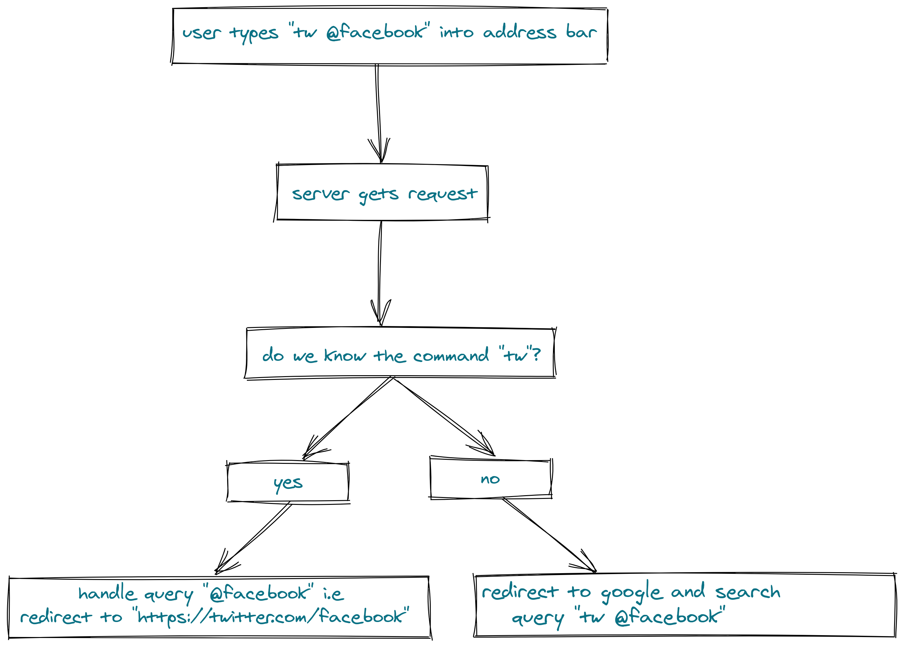

# Rusty Skywalker 

> A Powerful Bookmark Search Tool Powering Firefox & Chrome!

<p align="center">
    <br>
    <a href="https://github.com/imskr/Rusty-Skywalker/releases"></a>
    <a href="https://travis-ci.com/github/imskr/Rusty-Skywalker"></a>
</p>
<hr noshade>

## Prerequisites

* Make sure you have Rust installed. 

```shell
$ curl --proto '=https' --tlsv1.2 -sSf https://sh.rustup.rs | sh
```
* Rocket uses the nightly version of Rust so make sure you use that.

```sh
# from the root of the project
$ rustup override set nightly
```

## Installation

### Local
* Clone the repository.
```sh
$ git clone https://github.com/imskr/Rusty-Skywalker.git
```

* Build the project.
```sh
$ cargo build
```

* Run the project.
```sh
$ cargo run
```

* Visit localhost.
```
http://localhost:8000
```

## Queries and Commands

<p align="center">
    
</p>
